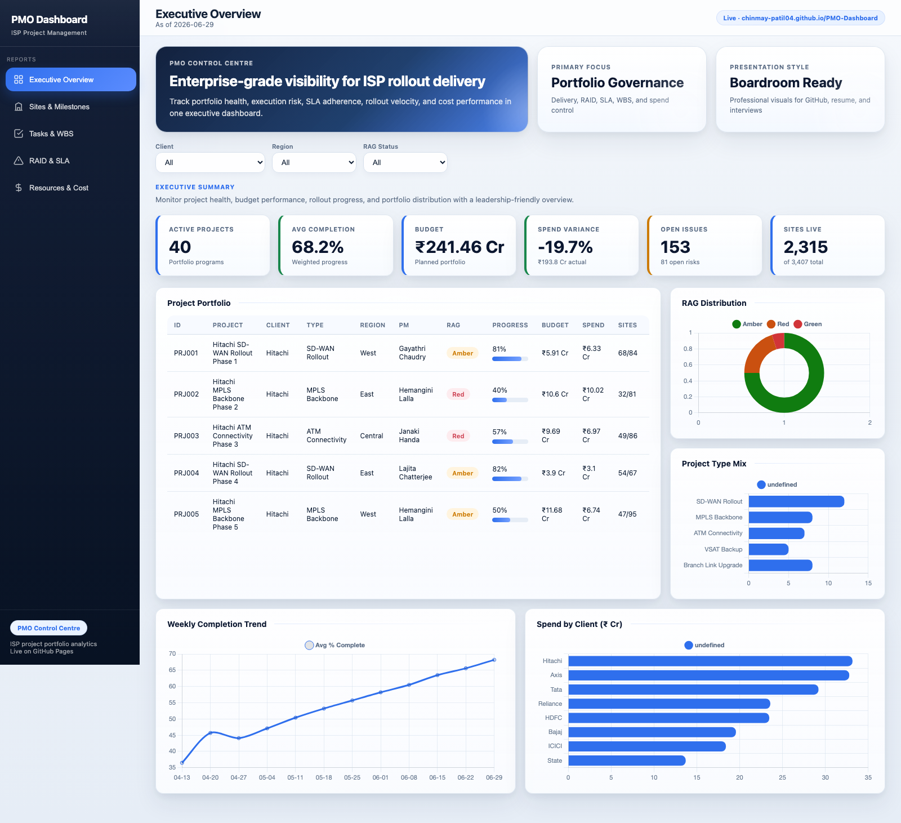
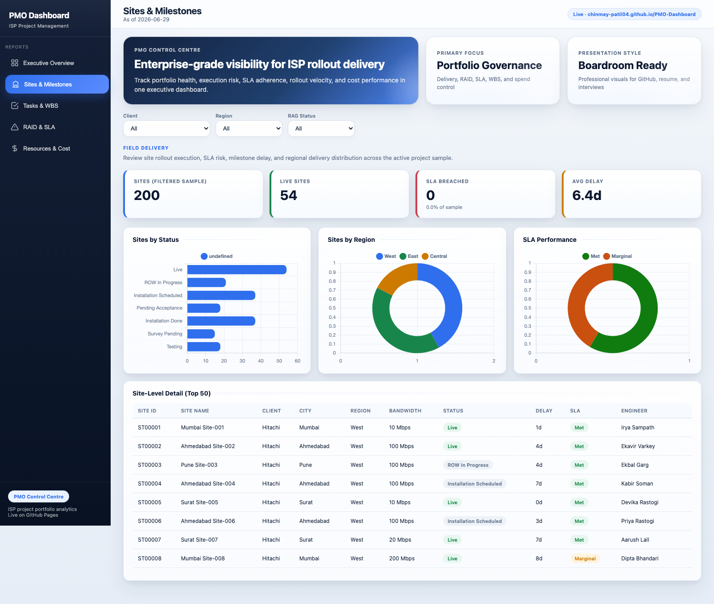
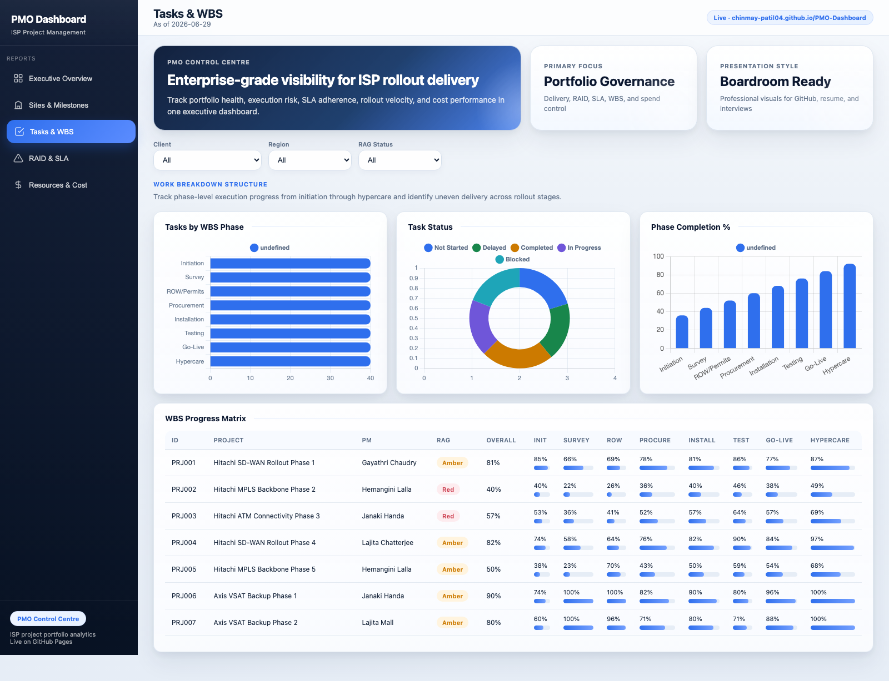
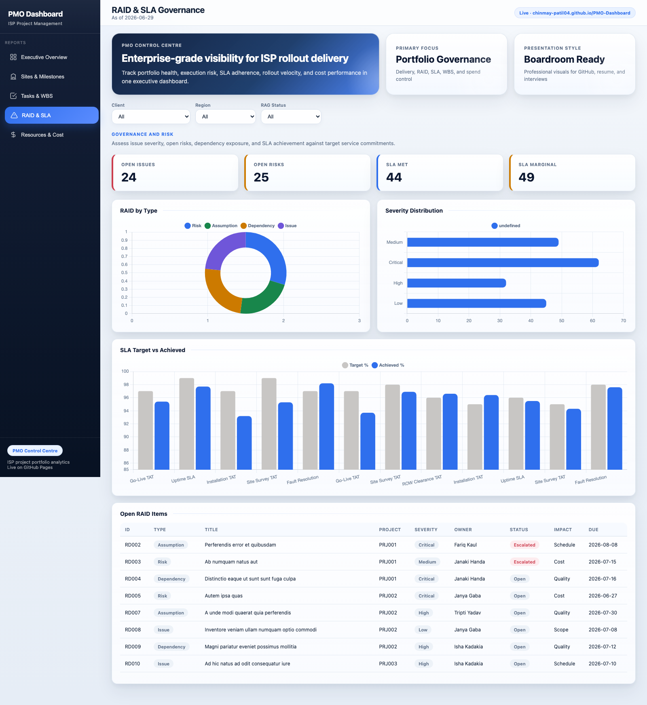
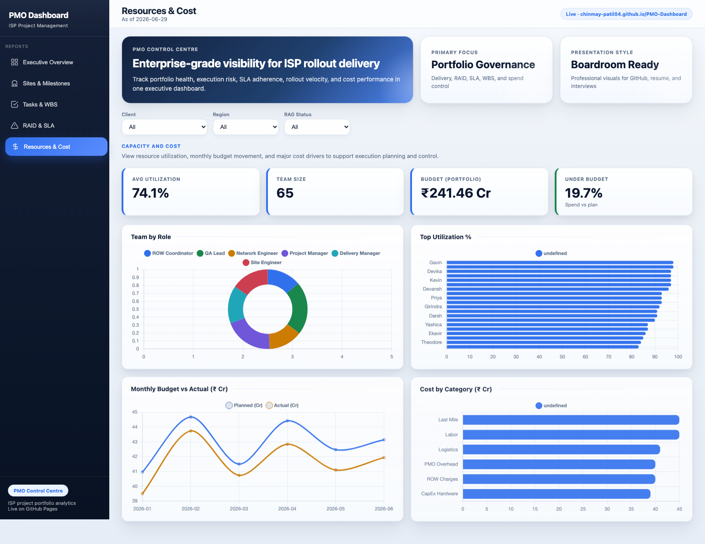

# PMO Dashboard · ISP Project Management

[](https://chinmay-patil04.github.io/PMO-Dashboard/)
[](https://github.com/Chinmay-Patil04)
[](https://github.com/Chinmay-Patil04/PMO-Dashboard)

**Enterprise PMO Control Centre** for ISP and telecom delivery — portfolio governance, site rollout, WBS execution, RAID and SLA monitoring, and cost analytics. Built as a **boardroom-ready** portfolio project with live demo, star-schema Excel data, and a native Power BI build guide.

**Author:** [Chinmay Kaluram Patil](https://github.com/Chinmay-Patil04)

---

## Live links

| Resource | URL |
|----------|-----|
| **Live dashboard** | [chinmay-patil04.github.io/PMO-Dashboard](https://chinmay-patil04.github.io/PMO-Dashboard/) |
| **Source code** | [github.com/Chinmay-Patil04/PMO-Dashboard](https://github.com/Chinmay-Patil04/PMO-Dashboard) |

---

## Dashboard preview

### Executive overview · PMO Control Centre



### Delivery, governance, and cost views

| Sites & milestones | Tasks & WBS |
|:---:|:---:|
|  |  |

| RAID & SLA | Resources & cost |
|:---:|:---:|
|  |  |

---

## What this dashboard delivers

- **PMO Control Centre** hero and executive summary for leadership-style reporting
- **5 interactive report pages** with Client, Region, and RAG slicers
- **Professional UI** — enterprise color grading, card motion, page transitions, polished charts
- **39 ISP rollout programs** and **3,600+ sites** (SD-WAN, MPLS, VSAT, ATM connectivity)
- **Star-schema Excel dataset** (~6,700 rows) ready for Power BI import
- **Full Power BI guide** with relationships, DAX measures, and report layout

---

## Report pages

| Page | Focus |
|------|--------|
| **Executive Overview** | KPIs, portfolio table, RAG health, spend trend, client mix |
| **Sites & Milestones** | Site status, regional rollout, SLA performance, site-level detail |
| **Tasks & WBS** | Phase progress, task status, WBS matrix (Survey → Go-Live) |
| **RAID & SLA** | Open risks/issues, severity, SLA target vs achieved |
| **Resources & Cost** | Utilization, budget vs actual, cost by category |

---

## Repository contents

| Asset | Description |
|-------|-------------|
| `index.html` + `css/` + `js/` | Live PMO dashboard (Chart.js, animations, slicers) |
| `data/Isp_Pm_RawData_PowerBI.xlsx` | 10 related tables — star schema for Power BI |
| `data/dashboard-data.json` | Aggregated metrics for the web app |
| `data/generate_data.py` | Regenerate realistic ISP PM sample data |
| `POWERBI_BUILD_GUIDE.md` | Step-by-step `.pbix` build in Power BI Desktop |
| `assets/screenshots/` | README and portfolio preview images |

---

## Data model

```
Client_Master ──< Projects ──< Sites_Milestones
                    │
                    ├──< Tasks_WBS
                    ├──< RAID_Log
                    ├──< Budget_Costs
                    ├──< SLA_Governance
                    └──< Weekly_Status_Log

Date_Dimension (relate on date columns)
```

**Keys:** `ClientID`, `ProjectID`, dates → `Date_Dimension[Date]`

**Sample clients:** Hitachi Payment Services, Axis Bank, SBI, Bajaj Finance, HDFC, ICICI, Tata Motors, Reliance Retail

---

## Tech stack

- **Frontend:** HTML5, CSS3, Chart.js, GitHub Pages
- **Data:** Python (openpyxl, Faker), Excel, JSON
- **Analytics:** Power BI (import mode, DAX, star schema)

---

## Local preview

```bash
git clone https://github.com/Chinmay-Patil04/PMO-Dashboard.git
cd PMO-Dashboard
python3 -m http.server 8080
# Open http://localhost:8080
```

## Regenerate data

```bash
pip install openpyxl faker
python3 data/generate_data.py
```

---

## Resume bullet

> Built a **PMO Control Centre dashboard** for ISP project delivery across **39 programs and 3,600+ sites**, with executive KPIs, SLA/RAID governance, WBS tracking, and cost views; designed **Excel star-schema data**, deployed a **live GitHub Pages demo**, and documented **Power BI DAX** implementation.

---

## Author

**Chinmay Kaluram Patil** — ISP / Telecom project management & analytics portfolio  
[GitHub](https://github.com/Chinmay-Patil04) · [Live PMO Dashboard](https://chinmay-patil04.github.io/PMO-Dashboard/)
